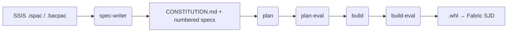

# Spec-Driven PySpark ETL for Microsoft Fabric

From SSIS packages → markdown specs → tested PySpark `.whl` → deployed SJD

**A local-first inner loop powered by custom Copilot agents**

---

## The problem

- Fabric notebook dev = browser IDE, slow clusters, no tests, no PRs
- Notebooks carry JSON wrappers, cell metadata, output blobs
- 2am outage → no commit history, no local repro
- Migrating **hundreds of SSIS packages** to PySpark by hand is untenable

---

## The approach

1. **Specs, not prompts** — markdown specs describe each ETL pipeline
2. **Packages, not notebooks** — deliverable is a tested `.whl`
3. **Local first** — dev container mirrors Fabric Runtime 1.3 exactly
4. **Agents do the typing** — custom Copilot agents read specs, write code, test, deploy

---

## Major components

- **GitHub repo** (template + PRs + CI)
- **Dev container** (Fabric Runtime 1.3 parity)
- **dev-loop** (orchestrator: plan → plan-eval → build → build-eval per spec)
- **Custom Copilot agents** (spec-writer, sjd-plan-eval, sjd-builder, sjd-reviewer)
- **Agent skills** (SSIS, DACPAC, Fabric ops, local-spark, docs)
- **Spec sets** (CONSTITUTION + numbered specs)
- **devops_helpers/** (Fabric REST CLI)
- **Fabric workspace** (Environment + SJDs + Lakehouse)

---

## Dev container = Fabric Runtime 1.3 parity

| Layer | Version |
|---|---|
| Python | 3.11 |
| Spark | 3.5 |
| Java | 11 |
| Delta Lake | 3.2 |
| JDBC | mssql-jdbc preinstalled |
| Tooling | Azure CLI, GitHub CLI, ruff, pytest, pre-commit |

**Same code runs locally and on Fabric** — only 3-4 narrow branch points (see `docs/LOCAL_VS_FABRIC.md`).

---

## The agents

| dev-loop phase | Custom agent used here |
|---|---|
| *(pre)* spec authoring | **spec-writer** — `.ispac` / `.bacpac` → CONSTITUTION + specs |
| plan | *default Copilot* (prompt lives in dev-loop's `plan.ps1`) |
| plan-eval | **sjd-plan-eval** |
| build | **sjd-builder** |
| build-eval (review) | **sjd-reviewer** |

Each has scoped tools and a tight system prompt — no single mega-agent.

---

## dev-loop — the orchestrator

[github.com/markgar/dev-loop](https://github.com/markgar/dev-loop) — PowerShell module that drives GitHub Copilot CLI one spec at a time.

<pre style="font-size: 0.55em; line-height: 1.2;">
Invoke-DevLoop -SpecsDir ./specs -ProjectDir . `
  -PlanEvalAgent sjd-plan-eval `
  -BuildAgent sjd-builder `
  -BuildEvalAgent sjd-reviewer

  preflight → [ plan → plan-eval → build → build-eval ] per spec
</pre>

- **4 phases per spec** — plan, plan-eval, build, build-eval (aka review)
- Every phase can be pointed at a **custom agent** via parameter; defaults to plain Copilot
- Each phase = `copilot -p "…" --yolo` with a crafted prompt
- Tracked in `.dev-loop/<timestamp>/` — logs, plan-*.md, manifest.json
- Checkpoint/resume: finished phases skipped on re-run

---

## Agent skills (domain knowledge, reusable)

- **ssis-analyzer** — parses `.ispac` / `.dtsx` into component/dataflow graphs
- **dacpac-analyzer** — extracts schemas from `.bacpac` / `.dacpac`
- **fabric-ops** — REST patterns, `updateDefinition`, LRO polling, Livy logs
- **local-spark** — session creation, lakehouse paths, dual-env branching
- **microsoft-docs** / **microsoft-code-reference** — grounding
- **microsoft-skill-creator** — meta-skill for building new skills

Skills keep agents grounded and consistent across runs.

---

## Spec-driven workflow

Start with source artifacts, end with a running Fabric SJD. Every arrow is a reviewable commit.



1. **spec-writer** reads the legacy SSIS package + database schema and produces a `CONSTITUTION.md` (global rules) plus one numbered markdown spec per pipeline.
2. **plan** — default Copilot turns one spec into a checklist of commit-sized tasks.
3. **plan-eval** — `sjd-plan-eval` checks the plan for gaps, ordering, scope creep; fixes it in place.
4. **build** — `sjd-builder` works the checklist, writing code + tests, running pytest, committing each task.
5. **build-eval** — `sjd-reviewer` does a senior-SWE review pass on the result.
6. Output: a tested `.whl` deployed as a Spark Job Definition.

**dev-loop** runs phases 2–5 per spec, one spec at a time.

---

## The inner loop (seconds, not minutes)

1. Edit `src/pyspark_sjd_devops_dailyetl/...`
2. `pytest -m "not integration"` → Spark session in container
3. Fix → repeat
4. Integration test against real lakehouse / SQL
5. `fabric_ops.py run` → deploy + run on Fabric
6. Pull logs, fix, repeat

**No browser. No cluster warmup. Git history the whole way.**

---

## devops_helpers/fabric_ops.py

CLI that wraps the Fabric REST API — the agent is instructed to use it **before** writing any raw HTTP.

```text
fabric_ops.py run        # Submit job, wait, show failure detail
fabric_ops.py status     # Latest run status
fabric_ops.py runs       # Recent runs
fabric_ops.py livy       # Livy session details
fabric_ops.py logs       # Driver stdout/stderr
```

Keeps Fabric interactions consistent; no reinvented API calls.

---

## Repo conventions that keep agents honest

- `.github/copilot-instructions.md` — global rules (Python 3.11, ruff, 120 cols, no `mssparkutils`, `DefaultAzureCredential` everywhere)
- `pyproject.toml` ruff rules: F, E, W, B, I, UP, S, PL
- `pytest` markers: `spark`, `integration`
- Pre-commit hooks enforce before the agent can push
- Source layout (`src/<package>/`) — production deliverable is a `.whl`

---

## What you might be missing / could add next

- **CI in GitHub Actions** — ruff + pytest on every PR, artifact the `.whl`
- **CD pipeline** — auto-deploy `.whl` to Fabric Environment on merge to `main`
- **Environment promotion** — dev / test / prod Fabric workspaces via variables
- **Secret management** — Key Vault + workspace identity (already partial)
- **Data quality gates** — Great Expectations or `dbt test`-style checks
- **Observability** — structured logging → Log Analytics, lineage via OpenLineage
- **Spec templates per pattern** — dim load, fact load, SCD2, CDC
- **Golden datasets** — small Delta fixtures checked in for deterministic tests
- **Cost guardrails** — Fabric capacity monitoring, job size limits
- **Agent evals** — measure spec → working SJD success rate over time

---

## Why this works

- **Specs are reviewable** — PRs on markdown before code is written
- **Code is testable** — plain Python package, not a notebook blob
- **Local ≈ Fabric** — parity container kills the "works on my cluster" class of bugs
- **Agents are scoped** — small system prompts + skills beat one giant prompt
- **Humans stay in the loop** — at the spec, the plan, and the review

---

# Questions?

Repo: `pyspark-sjd-devops-dailyetl`
Docs: `docs/LOCAL_VS_FABRIC.md`, `docs/AGENT_SKILLS_IN_DEVCONTAINERS.md`
Agents: `.github/agents/`
Skills: `.github/skills/`
